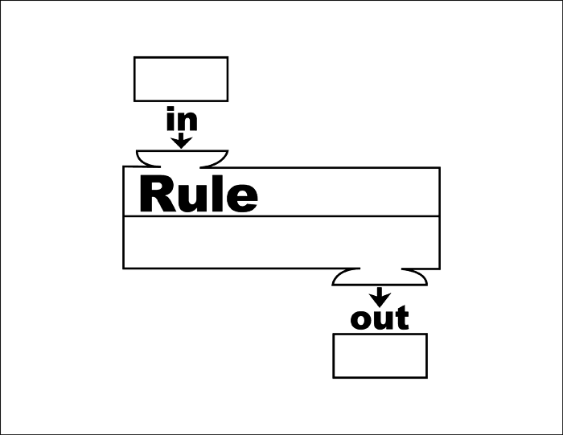

# Objects, Classes, Variables, and Functions

This lesson will cover making objects and classes

# Review
## 📝 Questions
*Please handwrite out your answers to these questions. Answer to the best of your ability*
*Make sure to handwrite your answers, you'll learn it faster I promise*
1. What is an object?
2. What is a class?
3. What is a function?
4. What is a variable?
5. How do you initialize a variable in java?
6. In `public static void main(String[] args)` what does each word mean?
7. What is the difference between a static and non-static variable?
8. What is the difference between a static and non-static function?
9. What is a constructor?
10. Explain Inheritance
11. What does `Super` mean?
12. what does an else if statement do?

## 📖 Notes on Functions
Think of a function as a self-contained black box, that takes a set of inputs and gives an output. <br><br> kind of like these diagrams you saw in elementary school:

<br>

The code in the function is to explain the rule.

## 📖 Notes on objects
In programming, an object is something that houses data and behavior.

A class is a template for an object. It contains all the variables and functions that will make up the object but it does not define any specific values for any of their properties.

Take a look at this example:

```java
public class Car {
  private int speed;
  public void accelerate() { 
    speed += 5; 
  } 
} 
```
In this example, `Car` is the class, and `speed` and `accelerate()` are the variables and functions that make up the Object. <br><br> To create a car object we would say `Car myCar = new Car()`.  


## 📖 Notes on Variables 
Variables are the containers that help keep track of data in our programs. Variables can be of different types such as integers (whole numbers), floating points (numbers with decimal points), strings (text), etc. Variables must be declared before they can be used. This is done with a keyword such as `int` or `String`. 

In Java, variables must be initialized before they can be used (assigned a value). This is done by using the keyword `=` followed by a value.  <br> <br> For example:  `int x = 5;`


## 📖 Notes on Constructors
A constructor is a special kind of function used to create an instance of an object. It is called when the object is created and it is used to initialize all the variables associated with an object.  A constructor is always named after the class it is defined in and it does not have any return type. For example: 


```java 
public class Car { 

    private int speed; //declaring instance variables

    public Car() { //constructor				//constructor always named after class name  								and has no return type  
        speed = 0; // initializing instance variables     // conventionally constructor name should start with capital letter  

    }

    public void accelerate() { //example of instance method  
        speed += 5; //increasing speed by 5

    } 
}  
```

 Here, the constructor initializes the instance variable "speed" to 0 when an object of type "Car" is created.

 ## 📖 Notes on Inheritance 
Inheritance is the ability to create new classes that reuse, extend, and modify existing classes (inherited class or parent class) to create a new one (inheriting class or child class). This allows us to reuse code from existing classes and create new ones that use the same code with a few modifications. <br><br> In Java, Inheritance is achieved by using the `extends` keyword. For example: 

 ```java
public class Animal {   //parent class / base class / superclass

    private String name;

    public Animal(String name) {   //constructor with parameter name  
        this.name = name;  
    }  

    public String getName() {   //accessor getName() to return name  
        return name;  
    }  
}  
``` 

 ```java  
public class Cat extends Animal { //child class / sub-class / derived class, extends Animal  

    public Cat(String name) {     //constructor which call parent constructor  
        super(name);              //using super keyword to call parent constructor  
    }                            //now Cat has all the members from Animal  

    @Override                     //override method from Animal  
    public String getName() {     //overriding getName method with new implementation 
        return "Cat " + super.getName();           //using super to call parent method implementation  					      super we can call parent methods even if they are overridden in child class      	}     }     ```      Here we have created a `Cat` class which inherits from `Animal`. This means that all the variables and methods of `Animal` are also available in `Cat`, plus any additional variables or methods that we want to add in `Cat`. We can also override existing methods of the parent class.
```
	
# Coding
## 🤖 Make an Object!

1. In BlueJ, open the `Intro-To-CS-Study-Guide/1` project
2. create a class called [your name] (make sure the first letter is capitalized)
3. write 3 functions in this class:
```java
    public String getName(){} // this function will return your name.
    public void printName(){} // prints your name
    public String introduce(String otherPersonName){} // returns "Hi [other person's name], I'm [your name]"
```
4. fill in these functions, so that they do the stuff
5. make a java object by right clicking your class<br>

	<br>
give it a name<br>
	<br>
run your functions on the object!<br>
	<br>

6. now make a `Person` class. This class should have one field called name, and a constructor that sets the name
7. Add in all the functions from the [Your Name] class. Rewrite them to work with the `this.name` field
8. Add another `introduce` function, this time it should take the argument `otherPerson` which will have a type of `Person`. This function should introduce `this` person to the other person
<br>Example in the BlueJ codepad:
 ```
>Person adam = new Person("Adam Alan Smith");
>Person lucas = new Person("Lucas");
>adam.introduce(Lucas);
Hi Lucas, I'm Adam Alan Smith 
```
<br>Example with objects:
> Create a Person object, with a name of instance as adam, and give it the name "Adam" <br>
> Create a Person object, call it lucas, and give it the name "Lucas" <br>
> right click on adam, and run the introduce function <br>
> you should get a terminal pop up that says "Hi Lucas, I'm Adam" <br>

9. Now you're going to make a third class called `SuperHero` which will extend Person
Think of extend like it's saying: "SuperHero is a type of person, who can do everything a person can, and more." 

10. SuperHero will have a field called heroName, which is their super hero alias. create this field.
11. Now you're going to make the constructor. This will take two arguments `(String name, String heroName)`. Fill in the constructor. <br>
> note: you should not have the line `this.name=name` in this constructor. Because SuperHero inherits from Person, you should figure out how to use `super()` to initialize name.
12. Override the introduce functions to print the hero's HeroName, not their person name. Make sure to add `@Override` above the functions to denote that you are changing what the function typically does.
13. Testing: make a SuperHero object for Spiderman.
what happens when you run `getName()` even though you never wrote a getName function?
make a person object. Can you introduce a person to a hero? what about a hero to a person.<br><br>
14. Try writing a `public string getRealName()` function that prints the SuperHero's real name without using `super.getName()`


## 🤖 Math 2: The squeakuel
Java has a class called math that is automatically imported into every project you make. To learn the difference between static and non-static variables and functions, we're going to make our own.
1. Make a class called Math2
2. Math2 is going to have some public static final fields: `PI` and `e`. initialize these variables to their proper values 
3. Math2 is going to have a static function `min(int a, int b)` which returns the minimum of two variables. Write this function.
4. Math2 is going to have a static function `max(int a, int b)` which returns the maximum of two variables. Write this function.
5. explain why these functions are static
6. (optional) add some more static functions to this class that would normally be in Math.
